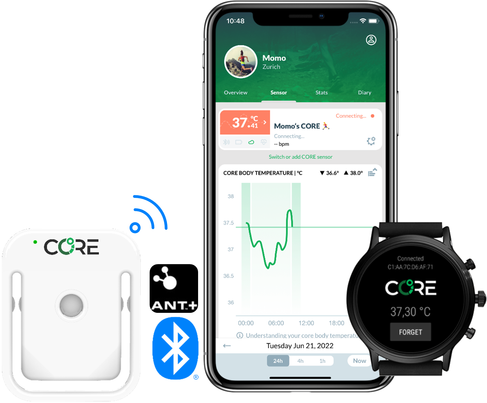

# CORE - Release your untapped power

CoreBodyTemp is the official repository of the Company that has invented CORE - a non-invasive wearable to monitor your Core Body Temperature

📫 Visit our webpage: [https://corebodytemp.com/](https://corebodytemp.com/)

In this repository you find code that we made publicly available. It will help you to build your own apps to communicate with CORE in no time!

| Project                                                                  | Description                                                                            |
| :----------------------------------------------------------------------- | :------------------------------------------------------------------------------------- |
| [CoreBodyTemp (This page)](https://github.com/CoreBodyTemp/)             | Specification of Core Body Temperature Service and Bluetooth implementation notes      |
| [ConnectIQ-CoreTemp](https://github.com/CoreBodyTemp/ConnectIQ-CoreTemp) | Some example Code for using the CoreTemp ANT+ profile on Garmin computers etc          |
| [wearos-app](https://github.com/CoreBodyTemp/wearos-app)                 | An example app that runs on wearOS by Google. Communicate to CORE via the BLE profile. |

Please find the specification of our custom Bluetooth Low Energy GATT service "Core Body Temperature Service" here:

- [Core Body Temperature Service.pdf](https://github.com/CoreBodyTemp/CoreBodyTemp/blob/main/CoreTemp%20BLE%20Service%20Specification.pdf)

Some notes that might help to implement the bluetooth profile of CORE can be found here:

- [CORE BLE Implementation Notes.pdf](https://github.com/CoreBodyTemp/CoreBodyTemp/blob/main/CORE%20BLE%20Implementation%20Notes.pdf)

## FAQ

### **Q:** Where can I find more developer notes?

**A:** Please visit our developer notes on https://corebodytemp.com/pages/tech-core-developer-information

### **Q:** How can I Bluetooth discover a CORE sensor?

**A:** Sensors that implement the CoreTemp Service will advertise the UUID of the CoreTemp Service in their advertisement data. Just filter your results for the UUID `00002100-5B1E-4347-B07C-97B514DAE121` in the list of advertised 128bit services. Please do not rely on the Bluetooth advertised name, it may not always contain the String `CORE`.

<!---
CoreBodyTemp/CoreBodyTemp is a ✨ special ✨ repository because its `README.md` (this file) appears on your GitHub profile.
You can click the Preview link to take a look at your changes.
--->
